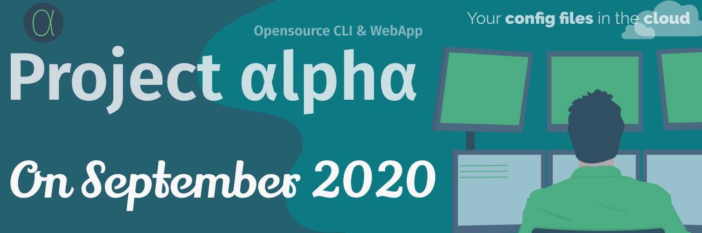

# The Project Alpha

          

## Contributors ✨

Thanks goes to these wonderful people ([emoji key](https://allcontributors.org/docs/en/emoji-key)):

<!-- ALL-CONTRIBUTORS-LIST:START - Do not remove or modify this section -->
<!-- prettier-ignore -->
<table>
  <tr>
    <td align="center"><a href="https://github.com/exiam"> <b>exiam</b></a> <a href="https://github.com/hugos29dev/the-Project-Alpha/commits?author=exiam" title="Code">💻</a> <a href="#platform-exiam" title="Packaging/porting to new platform">📦</a></td>
    <td align="center"><a href="https://github.com/kvsm"> <b>Kevin Smith</b></a> <a href="https://github.com/hugos29dev/the-Project-Alpha/commits?author=kvsm" title="Tests">⚠️</a></td>
    <td align="center"><a href="http://iam-abbas.github.io"> <b>Abbas</b></a> <a href="#infra-iam-abbas" title="Infrastructure (Hosting, Build-Tools, etc)">🚇</a></td>
  </tr>
</table>

<!-- ALL-CONTRIBUTORS-LIST:END -->

This project follows the [all-contributors](https://github.com/all-contributors/all-contributors) specification. Contributions of any kind welcome!
